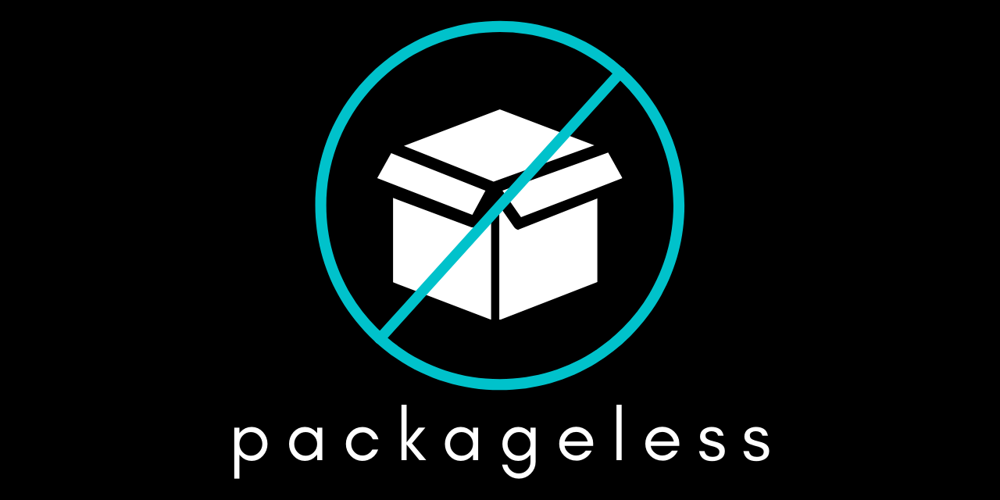

Thanks for checking out **packageless**! Keep reading for some information about **packageless**.

## What is packageless?
**packageless** is a package manager that utilizes containers to actually run the packages that you "install". With packageless you aren't actually "installing" packages but rather pulling images from a container image registry and creating volumes to be mounted to the container.

**packageless** will even set aliases so that you can use the packages exactly how you normally would!

## Why packageless?
**packageless** solves a few problems:
- You can now install any package on any OS, as long as it is capable of running in a container
- Depedency issues are limited due to each package being run in its own isolated environment
- Installs are faster due to having to only pull an image and not wait to download component from various different places
- When you uninstall a package it is truly uninstalled, all volumes and images associated with the package are removed

# Development
**packageless** is still in the very early stages of development and functionality is likely to change drastically

# Contributing
Contributing guidelines can be found at: https://everettraven.github.io/packageless/contrib

# Documentation
Documentation can be found at: https://everettraven.github.io/packageless/
